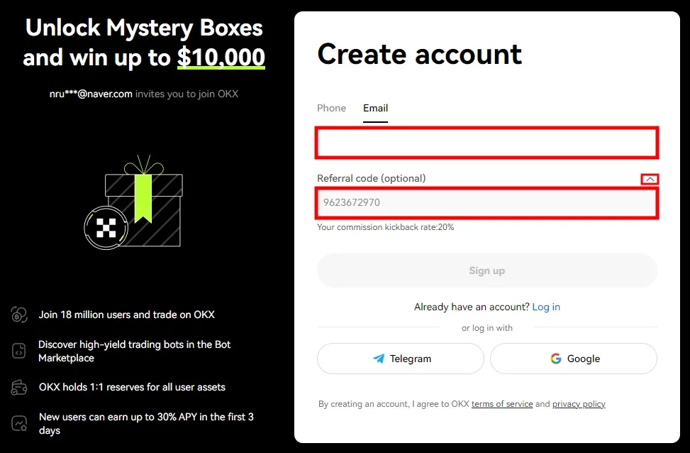
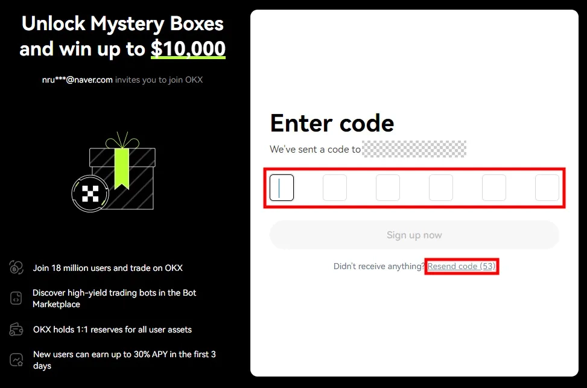
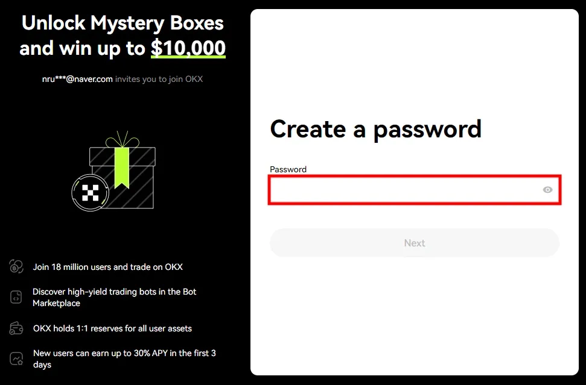
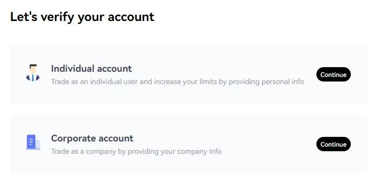
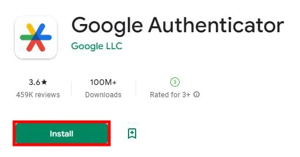
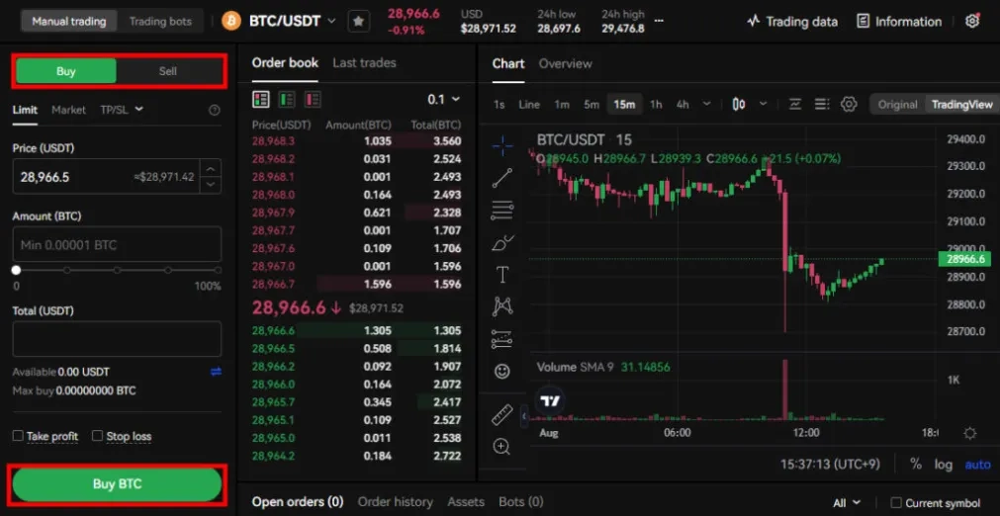
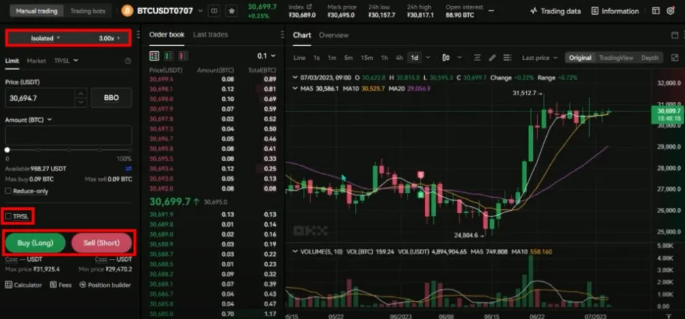
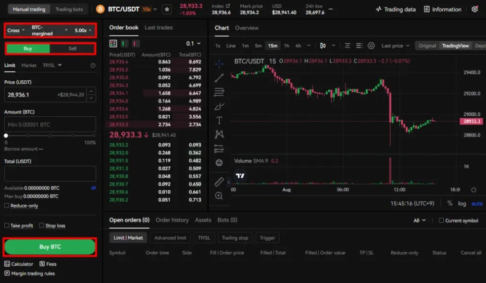
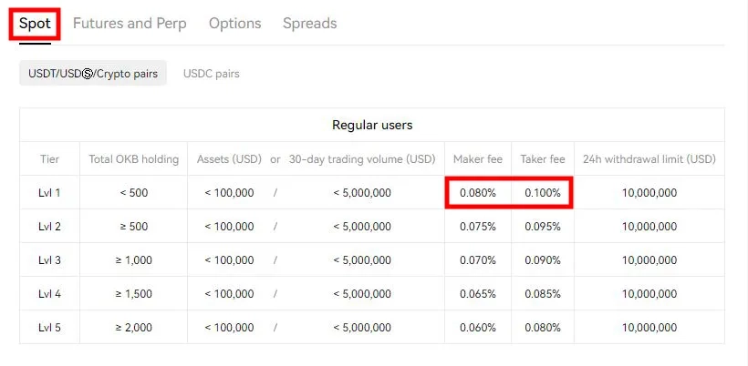
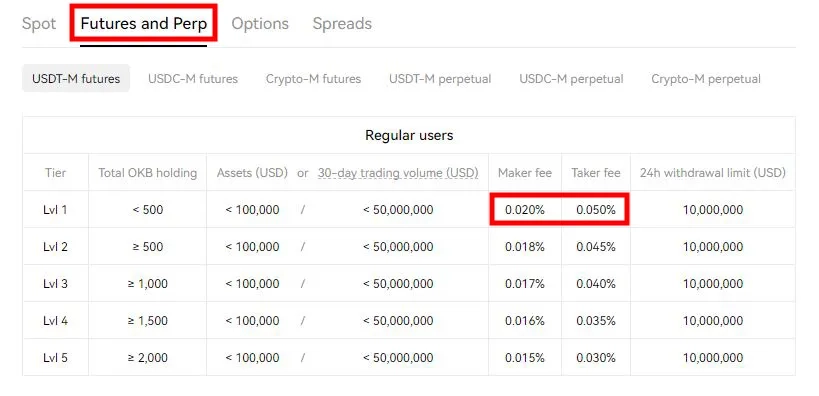

# OKX交易所注册教程 — 最高可享20%手续费折扣

---

对于刚入门加密货币交易的新手来说，选对平台能省下不少手续费，还能避免很多不必要的麻烦。OKX成立于2017年，目前是全球交易量第二大的加密货币交易所，支持350多种加密货币交易。通过推荐码注册，你最高可以拿到20%的手续费返佣——这笔钱积累起来其实挺可观的。下面我会一步步教你怎么注册，整个过程大概5分钟就能搞定。

---

## 注册OKX账户

### 第一步：填写邮箱并确认推荐码

首先进入OKX官网。在注册页面，你可以选择用手机号或邮箱注册，这里我用邮箱来演示。

填完邮箱后，记得点一下"Referral code"右边的小箭头，确认推荐码已经自动填入。如果没有自动填写，手动输入**62834398**——这个码能让你享受手续费折扣，别漏掉了。

### 第二步：输入邮箱验证码

点击继续后，你的邮箱会收到一个6位数的验证码。把验证码填进去就行。

如果没收到邮件，先去垃圾邮件箱翻翻，或者点下面的"Resend code"重新发送一次。

### 第三步：设置密码

确认完国家信息后，会弹出密码设置窗口。

密码要求至少8位，必须包含大写字母、数字和特殊字符。建议设置一个复杂点的密码，毕竟涉及资金安全。

---

## KYC身份认证和OTP设置

### 完成KYC身份验证

注册完账户后，强烈建议你马上完成KYC身份认证。

这一步主要是上传身份证或护照，验证你的真实身份。虽然有点麻烦，但能大幅提高账户安全性，也能解锁更高的提现额度。👉 [立即完成KYC认证，保障资金安全](https://www.okx.com/join/62834398)

### 开启OTP双重验证

OTP（一次性密码）是防止账户被盗的重要手段。

你需要下载Google Authenticator这个App，然后按照OKX页面的提示绑定。以后每次登录或提现，除了密码，还要输入这个App生成的6位动态验证码。虽然多了一步操作,但安全性提升了不止一个档次。

---

## OKX的三种交易方式

### 现货交易

现货交易就是最基础的买卖币操作。

你买了某个币，等它涨价后卖出,赚取差价。这种方式最简单直接,适合新手入门。不过缺点是只能做多不能做空——也就是说币跌的时候你只能干看着。

### 合约交易

合约交易就是预测币价涨跌方向。

你可以做多（赌涨）也可以做空（赌跌）,猜对了就赚钱,猜错了就亏钱。合约还支持杠杆功能,比如开10倍杠杆,收益和亏损都会放大10倍。不过要注意,如果亏损达到一定比例,系统会强制平仓止损。

这种玩法风险高,收益也高,建议先用小资金练手。

### 杠杆交易

杠杆交易是用你持有的币作为抵押,向平台借币来交易。

和合约的区别在于,杠杆是在现货市场借实际的币来买卖,而合约只是对价格下注。杠杆交易每24小时要支付利息,持仓时间越长成本越高。

---

## OKX手续费一览

### 充值/提现费用

充值完全免费。

提现费用根据不同币种有所差异,一般来说主流币种提现费都比较低。

### 现货交易手续费

基础费率是:挂单(Maker)0.08%,吃单(Taker)0.1%。

这个费率在主流交易所里算是中等偏低的水平,如果你的交易量大或者持有平台币,还能享受更多折扣。

### 合约交易手续费

基础费率是:挂单0.02%,吃单0.05%。

需要注意的是,实际扣费会乘以你的杠杆倍数。比如你开了10倍杠杆,那手续费也会相应放大10倍。

### 杠杆交易手续费

杠杆交易的手续费和现货一样,挂单0.08%,吃单0.1%。

但要额外支付借币利息,每24小时结算一次。所以杠杆交易不适合长期持仓,更适合短线操作。

---

## OKX的其他功能

除了基础的交易功能,OKX还提供质押挖矿、加密货币借贷、流动性挖矿和NFT市场等服务。

平台支持超过350种加密货币,从比特币(BTC)、以太坊(ETH)这些主流币,到狗狗币(DOGE)、BNB、ADA等热门币种都能交易。

安全方面,OKX采用了旅行规则等多重安全机制,资金和信息保护做得挺到位。而且OKX有iOS和Android双平台的移动App,随时随地都能交易。

---

## 总结

如果你是刚接触加密货币交易的新手,OKX是个不错的起点。界面简洁易懂,功能齐全但不复杂,最重要的是手续费相对较低。通过推荐码注册还能享受返佣,长期下来能省不少钱。👉 [使用推荐码62834398注册OKX,开启你的加密货币交易之旅](https://www.okx.com/join/62834398)
